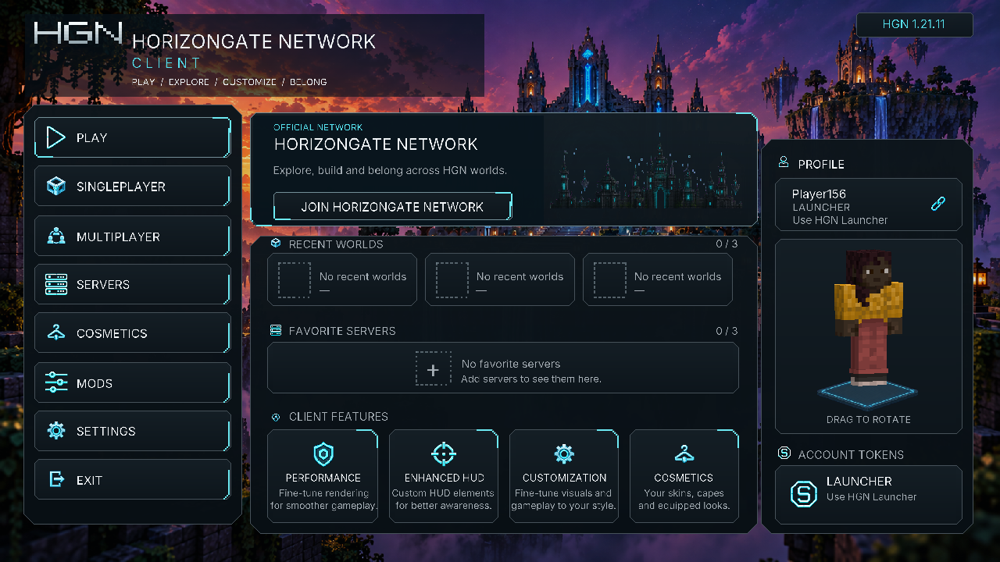
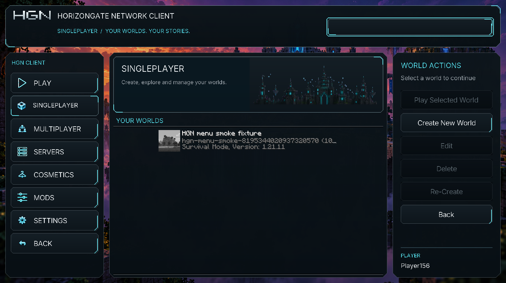
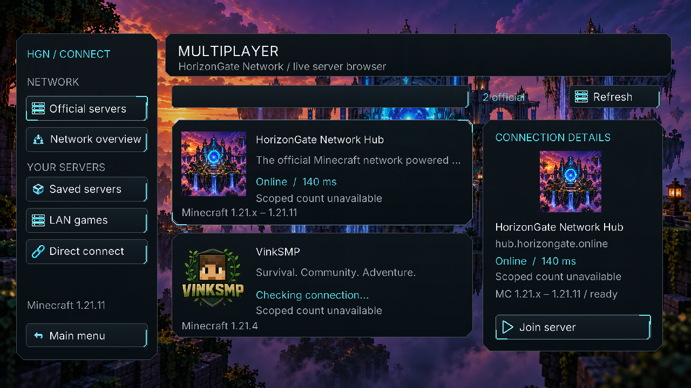
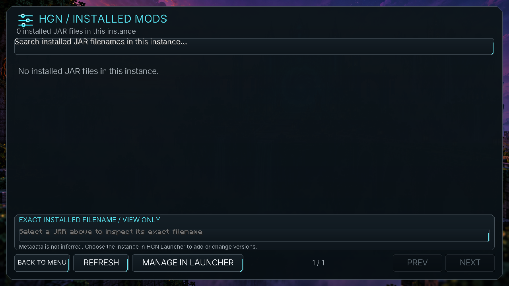
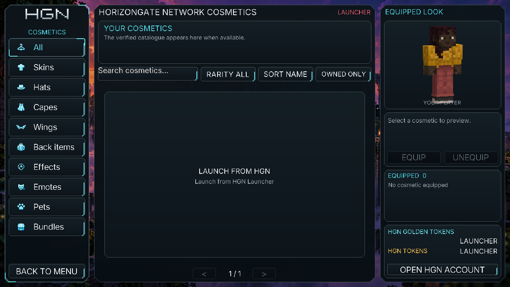
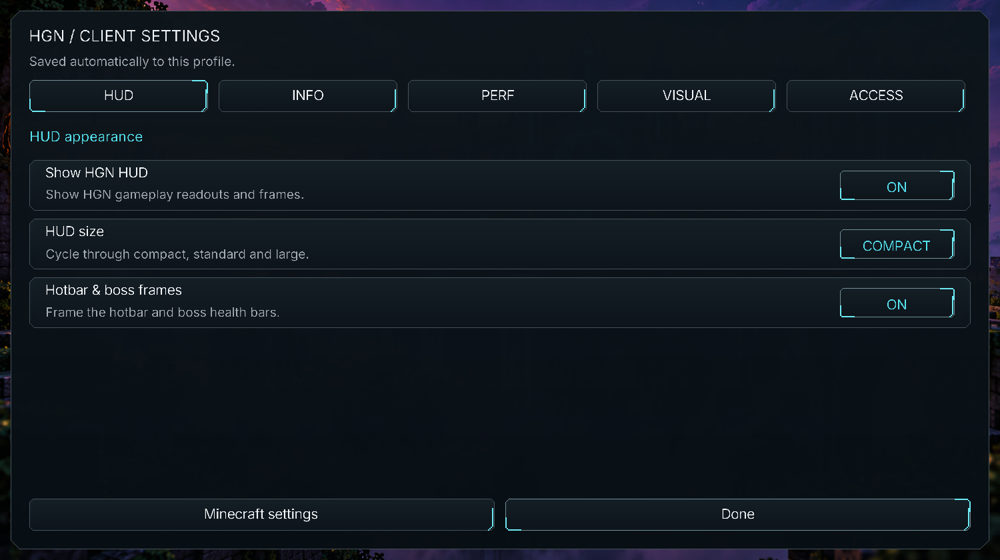
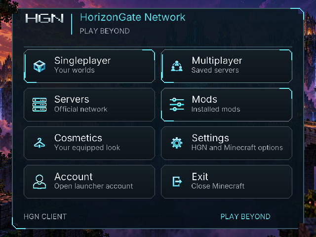
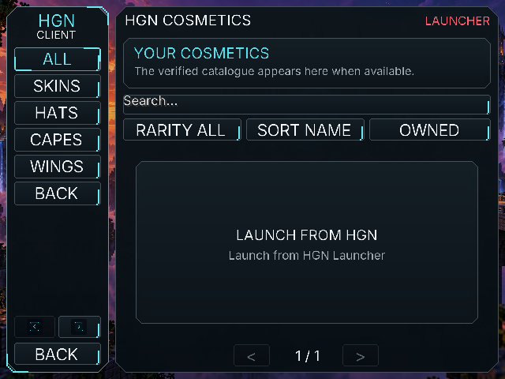
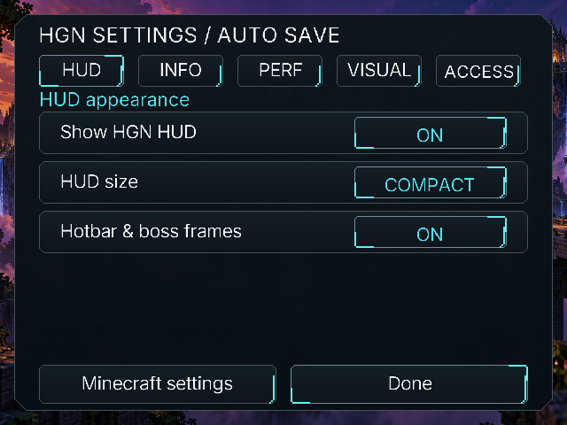
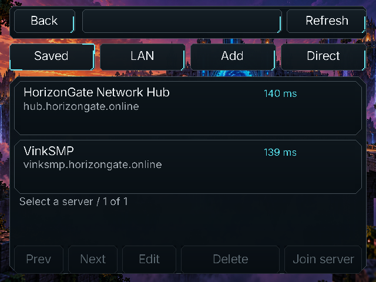

# HGN Client builds


The banner and [Hub artwork](.github/assets/server-hub-v2.png) are HGN
illustrations. They are not gameplay screenshots.

Published builds of the HGN Minecraft client patch layer. The HGN Launcher
downloads the build matching an instance's loader and Minecraft version when the
instance is created, so the launcher itself does not have to ship a jar for every
combination.

This repository holds build output and public release previews. The source
lives in the `client/` directory of the HGN Launcher repository.

## Layout

```
releases/<release-name>/manifest.json
releases/<release-name>/jars/hgn-client-<minecraft>-<loader>.jar
```

Each release-scoped `manifest.json` binds the exact release identity and targets:

```json
{
  "schema": 1,
  "clientVersion": "1.8.15-alpha.1",
  "releaseName": "ALPHA-V1.8.15",
  "builds": [
    {
      "minecraft": "1.21.4",
      "loader": "fabric",
      "file": "releases/ALPHA-V1.8.15/jars/hgn-client-1.21.4-fabric.jar",
      "size": 23141503,
      "sha256": "..."
    }
  ]
}
```

The launcher verifies the SHA-256 of every download and refuses to create an
instance it cannot patch.

## Packaged PC preview

These are screenshots from the packaged 1.21.11 Fabric `1.8.15-alpha.1`
test client at source commit `289d4a4`, not the design mockups. The capture
uses a disposable world and an unlinked account: Cosmetics has no verified
catalogue or wallet, and the empty Mods list is not a mod-search test. Server
latency is a live Minecraft ping; per-server player counts stay unavailable
until a trusted network backend supplies scoped counts.

| Menu | Worlds |
| :---: | :---: |
|  |  |
| Servers | Installed Mods |
|  |  |
| Cosmetics (unlinked) | Settings |
|  |  |

At a 640 × 480 window, the menu, Cosmetics, Settings, and saved-server
controls keep usable native-size actions:

| Menu | Cosmetics | Settings | Saved servers |
| :---: | :---: | :---: | :---: |
|  |  |  |  |

These renders do not prove an authenticated purchase/equip flow or that the
separate membership backend and Velocity proxy are deployed.

## Coverage

The ALPHA-V1.8.15 client matrix covers Minecraft 1.21 through 1.21.11 on Fabric,
Forge, and NeoForge: 35 exact version/loader combinations. The launcher package
defines the supported targets; an individual server can still require a specific
Minecraft version. UI appearance is subject to owner feedback during Alpha.

Excluded targets:

- Forge publishes no build for 1.21.2.
- Minecraft 26.x is not supported by this release's compatibility adapters.

## Updating

From the launcher repository, after building the current targets:

```
node client/tools/collect-builds.mjs <path-to-this-repo>
```

Then commit and push the new release tree. Published manifests and jars are
immutable. Adding a Minecraft target requires a new launcher/client release
identity; never widen or overwrite an existing release tree. Historical root
artifacts remain for older launchers.

Launcher installers and checksum updater manifests are attached to the matching
[public Alpha release](https://github.com/HorizonGate-Minecraft-Plugins/hgn-client-builds/releases).
Downloads do not require a GitHub account or source-repository access.
